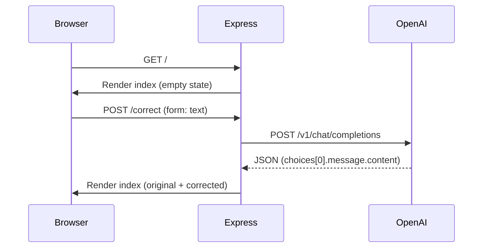

<div align="center">

# AI Grammar

**A minimal, elegant web app that sends your text to OpenAI and returns grammar‑polished copy—** built with **Node.js**, **Express**, and **EJS**, styled with **Bootstrap 5** and **Font Awesome**.

[](https://nodejs.org/)
[](https://expressjs.com/)
[](https://platform.openai.com/)
[](./package.json)

</div>

---

## Table of contents

- [Overview](#overview)
- [Features](#features)
- [How it works](#how-it-works)
- [Tech stack](#tech-stack)
- [Project layout](#project-layout)
- [Prerequisites](#prerequisites)
- [Setup](#setup)
- [Running locally](#running-locally)
- [Environment variables](#environment-variables)
- [API details](#api-details)
- [Security & limits](#security--limits)
- [Troubleshooting](#troubleshooting)
- [License](#license)
- [Original README gallery](#original-readme-gallery)

---

## Overview

**AI Grammar** (npm name `ai-grammar`) is a small **Express** server that renders a single-page experience (`views/index.ejs`). Users paste text, submit the form, and the server calls **OpenAI Chat Completions** (`gpt-4o-mini`) with a simple instruction to correct the text. The corrected result appears beside the input—ideal for demos, coursework, or a personal grammar helper.

---

## Features

| | |
|---:|---|
| **AI correction** | POST `/correct` sends trimmed input to OpenAI and displays the model reply |
| **Model** | `gpt-4o-mini` (fast, cost‑effective) |
| **UI** | Two‑column layout: input vs output, feature highlights, responsive Bootstrap |
| **Theming** | Full‑viewport background image + card‑based content |
| **Config** | `dotenv` for local secrets; `PORT` defaults to **5000** |

---

## How it works



1. **`GET /`** — Renders `index` with empty `originalText` and `corrected`.
2. **`POST /correct`** — Reads `text` from `application/x-www-form-urlencoded` body, trims it, calls OpenAI, then re‑renders the page with `originalText` and `corrected` (or an error message if the request fails).

---

## Tech stack

| Layer | Choice |
|--------|--------|
| Runtime | **Node.js** (ES modules — `"type": "module"`) |
| Server | **Express 4** |
| Templates | **EJS** |
| HTTP client | **node-fetch 3** |
| Config | **dotenv** |
| UI | **Bootstrap 5.3** (CDN), **Font Awesome 6** (CDN) |

---

## Project layout

```
AI-GRAMMAR/
├── app.js              # Express app, routes, OpenAI integration
├── package.json
├── package-lock.json
├── views/
│   └── index.ejs       # Landing page + form + output
└── README.md
```

---

## Prerequisites

- **Node.js** 18+ recommended (for native `fetch` alignment; project uses `node-fetch` for outbound calls).
- An **OpenAI API key** with access to **`gpt-4o-mini`**.

---

## Setup

```bash
git clone https://github.com/PRAJWAL-BR-0304/AI-GRAMMAR.git
cd AI-GRAMMAR
npm install
```

Create a **`.env`** file in the project root:

```env
OPENAI_KEY=sk-...your-secret-key...
PORT=5000
```

Never commit `.env` or share your API key.

---

## Running locally

```bash
node app.js
```

Then open **http://localhost:5000** (or whatever you set `PORT` to). You should see: `Server started on port …` in the terminal.

---

## Environment variables

| Variable | Required | Description |
|----------|----------|-------------|
| `OPENAI_KEY` | **Yes** | Bearer token for `https://api.openai.com/v1/chat/completions` |
| `PORT` | No | HTTP port (default **5000**) |

---

## API details

- **Endpoint used:** `https://api.openai.com/v1/chat/completions`
- **Model:** `gpt-4o-mini`
- **Payload (simplified):** `messages` with a short system line and a user message: `Correct the following text: …`
- **Limits in code:** `max_tokens: 100`, `temperature: 1`, `n: 1`

For production use you would typically tighten prompts, add rate limiting, validate length, and handle empty input explicitly.

---

## Security & limits

- Keep **`OPENAI_KEY`** only in environment variables or a secrets manager.
- This app is **not** production‑hardened: no auth, no rate limits, and errors surface generically to the user.
- **Costs:** every submission calls the OpenAI API; monitor usage in the OpenAI dashboard.

---

## Troubleshooting

| Symptom | Things to check |
|--------|------------------|
| “Error. Please try again.” | Valid `OPENAI_KEY`, billing enabled, model name available to your account |
| Port in use | Change `PORT` in `.env` |
| Module errors | Run `npm install` again; use a recent Node LTS |

---

## License

**ISC** — see [`package.json`](./package.json) (`license` field).

---

## Original README gallery

The screenshots below are **preserved exactly** from the earlier README (product UI and VS Code terminal).

AI GRAMMAR CORRECTOR WEBSITE :-

CODE SNIPPET USED IN VS CODE TERMINAL :-

